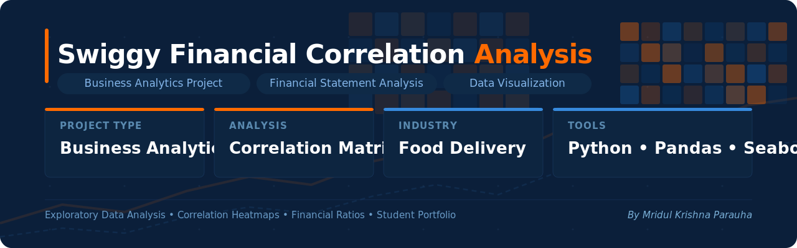
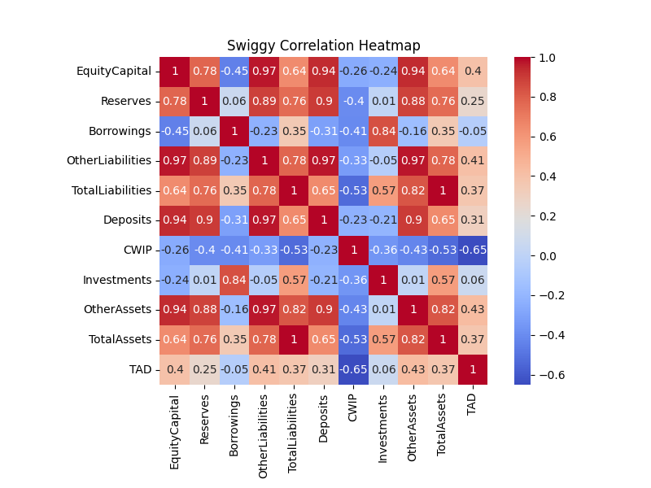

# 📊 Swiggy Financial Correlation Analysis

## Project Information

| Category | Details |
|----------|----------|
| Project Type | Business Analytics |
| Industry | Food Delivery |
| Company | Swiggy |
| Tools Used | Python, Pandas, Seaborn |
| Analysis Type | Correlation Analysis |
| Status | Completed |


## Executive Summary

Financial statements contain numerous interconnected variables that influence business performance.

This project applies correlation analysis and heatmap visualization techniques to Swiggy's balance sheet data to identify relationships among financial indicators and gain deeper insights into the company's financial structure.

The project demonstrates the practical application of Python-based business analytics techniques in financial analysis and decision-making.

## Business Context

Swiggy is one of India's leading food delivery and quick-commerce platforms. 

It was selected due to its rapid growth in India's food delivery and quick-commerce sector, making it an interesting case study for financial analytics.

Understanding relationships between financial statement variables can help analysts identify patterns in capital allocation, liabilities, investments, and asset growth.

This project explores these relationships using correlation analysis to uncover meaningful financial insights.

## Objectives

- Analyze Swiggy's financial statement data
- Calculate correlation coefficients among financial variables
- Visualize relationships using heatmaps
- Identify strong positive and negative relationships
- Derive business insights from financial patterns

## Dataset

### Source

The dataset was compiled using publicly available balance sheet information of Swiggy obtained from Screener.

### Dataset Scope

The dataset contains key financial statement variables across multiple reporting periods, including:

- Equity Capital
- Reserves
- Borrowings
- Other Liabilities
- Total Liabilities
- Investments
- Other Assets
- Total Assets

### Purpose

The dataset was used to explore relationships among financial variables and identify patterns through correlation analysis and heatmap visualization.

## Dataset Preview


## Tools & Technologies

| Tool | Purpose |
|--------|--------|
| Python | Data Analysis |
| Pandas | Data Processing |
| Seaborn | Heatmap Visualization |
| Matplotlib | Data Visualization |

## Methodology

### Step 1: Data Collection

Collected Swiggy financial statement data from Screener.

### Step 2: Data Preparation

Imported and prepared the dataset using Pandas.

### Step 3: Correlation Analysis

Generated a correlation matrix to identify relationships among variables.

### Step 4: Visualization

Created a heatmap using Seaborn to visually interpret the relationships.

### Step 5: Interpretation

Analyzed the correlation patterns and extracted business insights.

## Core Analysis

```python
corr = df.corr(numeric_only=True).round(2)

sns.heatmap(
    corr,
    annot=True,
    cmap="coolwarm",
    square=True
)
```

## Results

### Correlation Heatmap



## Key Findings

- Equity Capital and Deposits show a very strong positive correlation (0.94), suggesting that periods of capital growth were accompanied by increased deposit activity..
- Other Liabilities and Total Liabilities exhibit an extremely strong correlation (0.97), indicating that changes in total liabilities were largely influenced by changes in other liabilities.
- Investments and Borrowings show a strong positive relationship (0.84), suggesting a potential connection between financing activities and investment decisions.

## Business Relevance

Correlation analysis helps organizations:

- Understand relationships among financial indicators
- Identify performance drivers
- Support strategic decision-making
- Detect financial patterns and dependencies

This project demonstrates how analytics can convert raw financial statements into meaningful business insights.

## Learning Outcomes

Through this project, I strengthened my understanding of:

- Business Analytics
- Financial Data Analysis
- Correlation Analysis
- Data Visualization
- Python for Business Applications

## Future Scope

Potential extensions of this project include:

- Regression Analysis
- Financial Forecasting
- Interactive Power BI Dashboards
- Predictive Analytics Models
- Multi-Company Financial Comparison
  
## Conclusion

This analysis demonstrated how correlation techniques can uncover relationships among financial variables and support data-driven business understanding.

The project highlights the practical application of business analytics tools in exploring corporate financial performance and generating meaningful insights from structured data.

## About the Analyst

Mridul Krishna Parauha 

BBA (Digital Marketing & AI) Student

